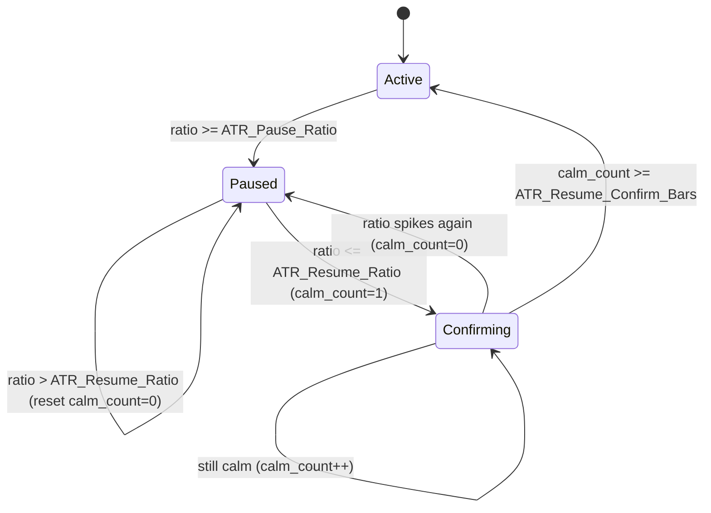

# ATR Integration — v1.6 (ATR Ladder Pause)

Add a v1.6 EA that **pauses grid-leg additions during high-volatility (fast) market conditions**, using a self-normalizing ATR ratio with hybrid resume (calm threshold + confirm bars) and single-leg re-baseline on resume.

**Goal**: prevent the lot-stacking that causes the recurring Jul-2024 / Jun-2023 emergencies.

- Base EA: [EA/AUDCAD_M15_v1_5.mq5](../EA/AUDCAD_M15_v1_5.mq5)
- Strategy lineage: [v1.5.md](../strategy/AUDCAD_M15_v1.5.md) (signal in [v1.md §1](../strategy/AUDCAD_M15_v1.md), gate in [v1.1.md §1](../strategy/AUDCAD_M15_v1.1.md), exit in [v1.2.md §2](../strategy/AUDCAD_M15_v1.2.md), sizing in [v1.3.md §2](../strategy/AUDCAD_M15_v1.3.md))
- Drawdown evidence: [back test result/drawdown_retrace_analysis.md](../back%20test%20result/drawdown_retrace_analysis.md), [back test result/summary.md](../back%20test%20result/summary.md)

---

## 1. Why this attacks the right failure mode

The only place legs get added is `CheckAdd()` in [EA/AUDCAD_M15_v1_5.mq5](../EA/AUDCAD_M15_v1_5.mq5) (Section 12, lines 695-755). It fires when price moves `Grid_Step_Pips` adverse from `last_price`, then stacks the next leg (sized `12*N × base`).

Every losing year shares one mechanism: the grid keeps stacking ever-larger legs **during** a sustained directional move until the 35% cap fires an emergency.

- 2024 Jul-16 LONG: −327.9 pips over a multi-day drop.
- 2023 Jun: back-to-back 200-pip / 245-pip whipsaws in 7 days.

If adds pause during the violent part of the move and only resume once price stabilizes, the basket stacks **fewer, cheaper** legs — lower total lots, lower floating loss, and a better weighted-average entry.

Note: pausing adds is almost mathematically equivalent to **widening the grid step** during high volatility — both reduce how many legs accumulate during the fast part of the move.

---

## 2. Volatility metric (self-normalizing)

- Use `ATR(14) / ATR(100)` on the M15 signal timeframe. This measures "current short-term vol vs its own ~1-day norm", so thresholds do **not** need re-tuning across 2023 / 2024 / 2025.
- Optional absolute floor (`ATR_Pause_Min_Pips`) so a high ratio on a tiny absolute move does not pause unnecessarily.

---

## 3. Hybrid resume state machine

Evaluated once per M15 bar close, before `RunTree`:

- `Active` = adds allowed (normal v1.5 behavior).
- `Paused` = `CheckAdd` returns early, no leg added, `last_price` untouched.
- The dead-band between `ATR_Resume_Ratio` (e.g. 1.2) and `ATR_Pause_Ratio` (e.g. 1.8) prevents flip-flopping; confirm bars require sustained calm before adds resume.

---

## 4. Resume add behavior — Option A (single leg + re-baseline)

`CheckAdd()` already adds **at most one leg per bar** and sets `last_price = add_px` (lines 749-750). So Option A needs almost no special code:

- **While paused**: skip the add and do NOT touch `last_price`.
- **On the first calm bar**: the normal `CheckAdd` fires exactly once at the current price and re-baselines `last_price` automatically.

### Worked example (recurring Jul-2024 LONG, `Grid_Step_Pips = 30`)

- L1 opens at `0.92216`, so `last_price = 0.92216`; normally L2 fires at `0.91916`.
- A fast drop plunges ~152 pips to `0.90700` with adds paused — no legs added on the way down.
- Volatility calms at `0.90700`. The next calm bar adds **one** leg at `0.90700` and sets `last_price = 0.90700`. The next leg only fires if price drops a further 30 pips to `0.90400`.

Result: one cheap leg near the bottom instead of 5 legs on the way down. Total lots stay small (low floating loss, cap unlikely to fire) and that single cheap leg pulls the weighted-average entry down hard, so a small bounce hits TP.

"Re-baseline" = resetting `last_price` to the resume price so the code does not try to catch up the ~5 skipped steps at once.

Emergency DD exit (`OnTick`, lines 1029-1050) and TP close (`CheckCloseTarget`) stay fully live during a pause — only leg additions pause.

---

## 5. New inputs (Section 1)

- `Enable_ATR_Pause` (bool, default `true`) — when `false`, v1.6 is bit-for-bit identical to v1.5 (parity gate).
- `ATR_Period_Fast` (int, default `14`)
- `ATR_Period_Slow` (int, default `100`)
- `ATR_Pause_Ratio` (double, default `1.8`) — pause when `atr_fast/atr_slow >=` this.
- `ATR_Resume_Ratio` (double, default `1.2`) — calm threshold (hysteresis dead-band).
- `ATR_Resume_Confirm_Bars` (int, default `3`) — consecutive calm M15 bars required to resume.
- `ATR_Pause_Min_Pips` (double, default `6.0`) — only pause if `atr_fast` in pips also exceeds this; `0` disables the floor.

All thresholds are PROVISIONAL defaults to be tuned via the backtest sweep in §8.

---

## 6. Code changes (new file `EA/AUDCAD_M15_v1_6.mq5`, copied from v1.5)

1. Header block: bump version to 1.60, document the ATR pause change and the `Enable_ATR_Pause=false` parity guarantee. Update `Log_File` default to `audcad_v1_6.csv`, comment string and CSV header `ea_version=v1.6`, order comments `audcad_v1.6_*`.
2. New inputs listed in §5.
3. Globals: `int h_atr_fast`, `int h_atr_slow`; `bool g_atr_paused`; `int g_atr_calm_count`; `double g_last_atr_ratio`; `double g_last_atr_fast_pips`.
4. New `UpdateAtrPauseState()`: copies ATR fast/slow (shift 1), computes ratio, runs the §3 state machine, logs `ATR_PAUSE` / `ATR_RESUME` events. Called at the top of `OnBarClose()` after `RefreshGate()`.
5. `CheckAdd()`: at the entry guard (line 697), add `if(Enable_ATR_Pause && g_atr_paused) { log ADD_PAUSED at Verbosity>=2; return; }` BEFORE the trigger/price calc, so `last_price` is never advanced while paused.
6. `OnInit()`: create `h_atr_fast` / `h_atr_slow` via `iATR(g_sym, Signal_Timeframe, period)`, validate handles, add a history guard (need `ATR_Period_Slow + 1` bars), print an `[ATR_PAUSE]` config line.
7. `OnDeinit()`: release ATR handles (`IndicatorRelease`).
8. SIGNAL diag log (line 854): append `atr_ratio` and `atr_paused` so backtests show the volatility state per bar. CSV column layout unchanged (extra data goes in the existing `note` field).

No change to sizing, FitCheck, WC_CONST, gate, signal confluence, TP, or emergency logic. FitCheck stays conservative (still assumes the full ladder), so pausing only ever lowers real risk vs the projection.

---

## 7. Docs

- New `strategy/AUDCAD_M15_v1.6.md`: document the ATR pause rule, the metric, the hybrid state machine, Option A resume, and the parity guarantee.
- Update [CLAUDE.md](../CLAUDE.md): add v1.6 row to version history, file map (EA + strategy), flip Active EA/strategy pointers to v1.6, add a "Locked mechanics" note for the ATR pause, and add the parity gate to validation gates.

---

## 8. Backtest matrix

Run in MT5 Strategy Tester: `AUDCADm#`, $2k, `Min_Confluence_Count=4`, `Grid_Max_Level_To_SL=6`, `Grid_Step_Pips=30`.

1. **Parity**: 2025 full year with `Enable_ATR_Pause=false`, fixed 0.10 -> must reproduce v1.5_2025_2k_v3 exactly ($2,137.14).
2. **Hard-year test**: 2024 full year, `Enable_ATR_Pause=true`, fixed 0.30 -> compare vs v5 (−6.35%, 1 emergency). Hypothesis: the Jul-16 basket pauses through the fast drop, stacks fewer lots, avoids or shrinks the emergency.
3. **Final gate**: 2023 full year, same on/off pair -> the historically worst, still-untested year.
4. **Easy-year regression**: 2025 full year, `Enable_ATR_Pause=true`, fixed 0.30 -> confirm pause does not hurt the calm year (expect near-identical to v5_2025 +20.57%, since 2025 lacked violent sustained moves).
5. **Lot unlock sweep**: if pause prevents the 0.30 emergency on 2024, sweep a larger fixed lot (0.40-0.50) to see how much extra return the pause safely unlocks.

Write each run up as a new `back test result/v1.6_*.md` following the existing naming, and add rows to [back test result/summary.md](../back%20test%20result/summary.md).

---

## 9. Out of scope (possible later variants)

- Gating new probe opens (not just adds) during volatility spikes — this idea is scoped to existing baskets.
- ATR-scaled dynamic grid step (mathematically related to pausing) — separate experiment.

---

## 10. Design decisions (locked with user)

- **Resume trigger**: Hybrid — ATR ratio must be back under the calm threshold AND stay there for `ATR_Resume_Confirm_Bars` consecutive bars before adds resume.
- **Resume add behavior**: Option A — add ONE leg at the stabilized price and re-baseline the grid from there (cheap leg near the bottom, minimal lots, good wavg pull).
